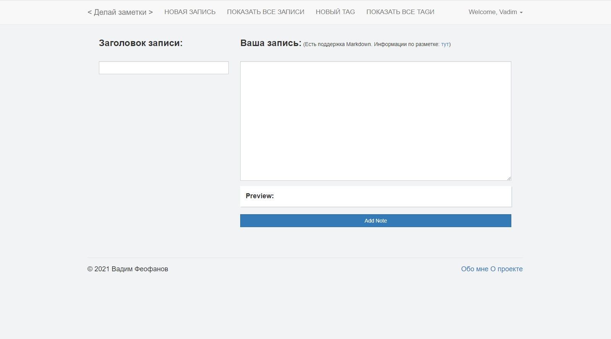
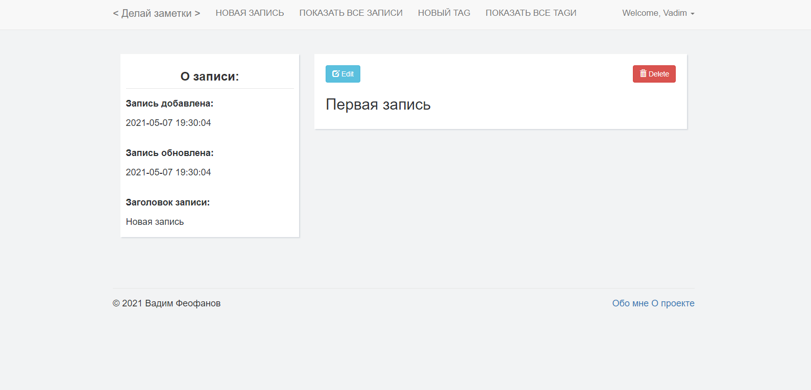
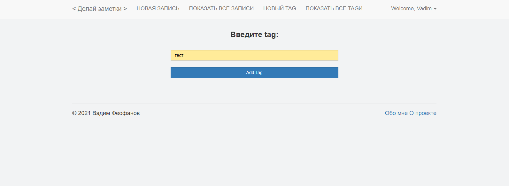
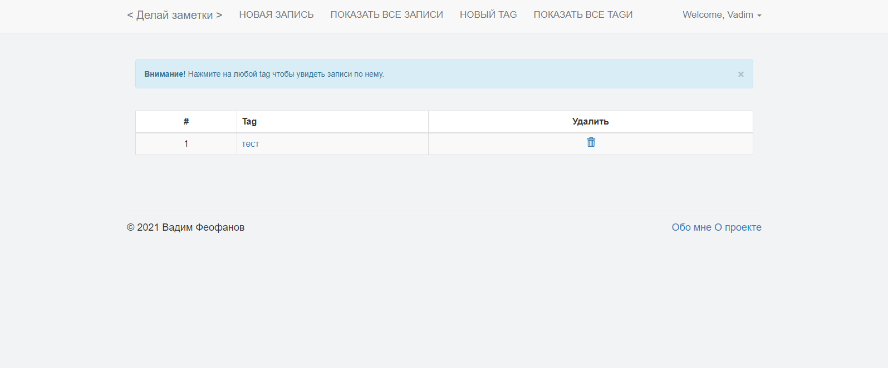
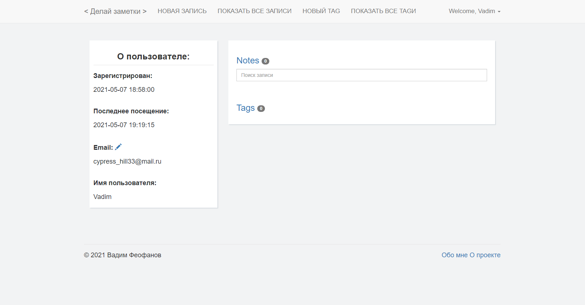

# Приложение онлайн-заметок
Создан на Flask

# Зависимости:

Для установки зависимостей выполните в терминале: 

`pip install -r requirements.txt`

# Использование:

Запустите эту команду в терминале:

`python manage.py`

Зайдите на `127.0.0.1:5000` в вашем браузере

# Результаты

## Создание новой записи
Простой интерфейс с просмотром markdown-разметки в режиме реального времени

## Просмотр записи
Простое редактирование и просмотр записи

## Добавить tag

## Просмотр tagов
По клику на tag можно просмотреть все записи с этим tagом

## Настройки профиля
В настройках профиля можно посмотреть информацию о пользователе, изменить email и просмотреть записи и tagи пользователя

